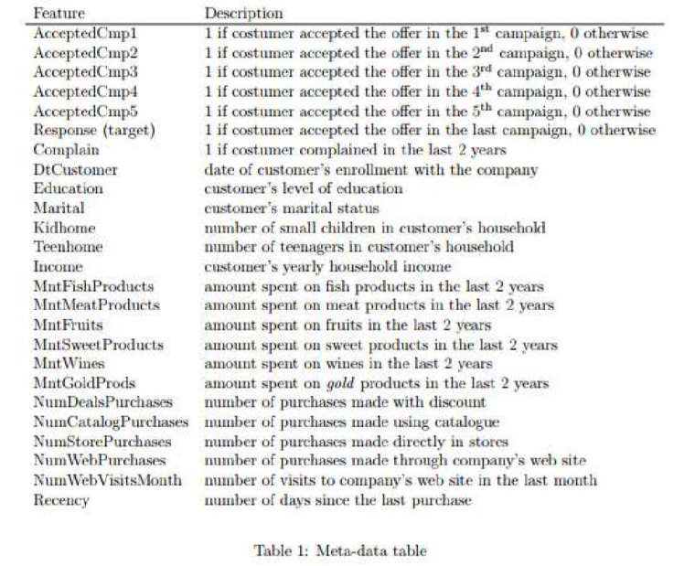
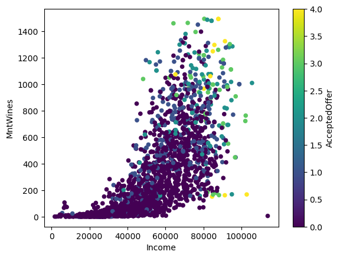

## Week 2: Pandas Descriptive Statistics Script

### Goal of the project:
Write a Python script that practices Exploratory Data Analysis on a dataset using Pandas Library

### Information about the DataSet
The dataset is a sample dataset from a food delivery platform, who collected 2240 customer's base information and interaction with the company.
Below are the Columns:

And you can learn more about the dataset from the project GitHub link: 

### Manipulate the Data
I found I am very interested in the correlation between the customer's income, spending on the platform, and the offer they accepted. 
* Loaded the data using pandas,
* Created a new column with the total spending of the customer on the platform's product
* Created a new column counting the total number of customers accepting an offer from the platform
* Made a subset of the data with only the income, spending, and offer columns

### Summary of the Data
I use `df.describe()` to summarize the data, reading its mean, median, and standard deviation.

Here are something I found by looking at the data:
* There are fewer people than I expected that accepted an offer
* People spent more money on wine on this platform, than fruit, meat, fish and sweets added together
* I don't know the unit for income. Because this is a company from Brazil, the currency might be the Brazilian Real instead of the US Dollar. However this information is not specified in the documentation of the data.

### Visualize the Data
I created a scatterplot of the data based on the income and total spending, and colored the plot with the number of accepted offer

* The higher the income, the more money the customer will spend on the platform. The relationship is not linear, but exponential.
* The higher the income, the larger the variance of the spending.
* People who accept more offers are the ones with higher income and higher spendings

* I also found that, compared to other categories, spending on meat had less variance (the dots clustered closer). I think the reason behind it might be the requirement and price of meat have less variance, compared to other more luxury products.

